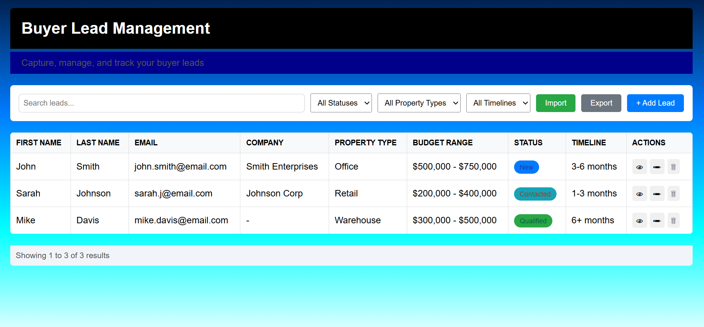

The Buyer Lead Intake Management System** is designed to help businesses and agents capture, organize, and manage buyer leads efficiently. It simplifies the process of collecting client information, tracking lead status, and generating insights for better follow-ups. Built with Next.js, Supabase, and React Native, it works seamlessly across web and mobile platforms.

